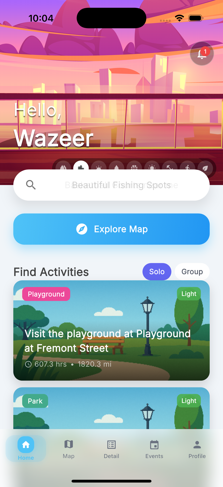
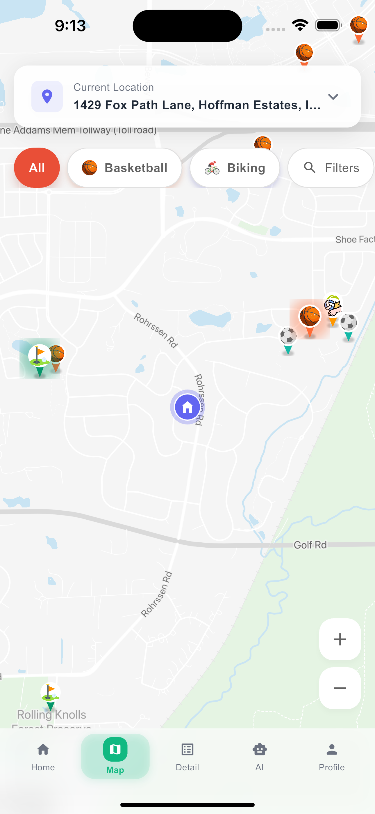
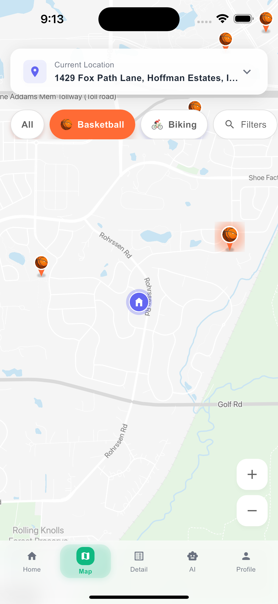
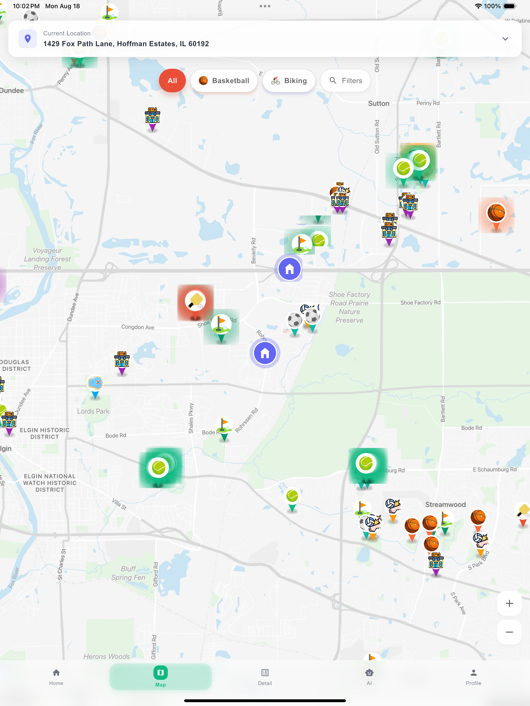

<p align="center">
  <h1 align="center">TRAX</h1>
  <p align="center">
    <strong>Real-time sports facility discovery platform</strong>
    <br />
    Find courts, fields, and trails near you — powered by geospatial data and AI.
    <br />
    <br />
    <a href="https://sportsfinderapp.vercel.app"><strong>Live Demo</strong></a>
    &nbsp;&middot;&nbsp;
    Built with Flutter &middot; Supabase &middot; PostGIS &middot; Gemini AI
  </p>
</p>

<br />

<p align="center">
  
  &nbsp;&nbsp;
  
  &nbsp;&nbsp;
  
</p>

<br />

---

## What it does

TRAX helps users discover 200+ sports facilities across 50+ parks — basketball courts, tennis courts, pickleball, soccer fields, trails, playgrounds, and more. All in one map, with real-time filtering and AI-enhanced facility details.

**The problem:** Finding where to play sports shouldn't require checking 10 different websites. Park district sites are scattered, incomplete, and don't show you what's actually near you.

**The solution:** A single, map-first experience that aggregates facility data from multiple sources and presents it with the detail and immediacy of a native app.

## Key Features

- **Interactive Map** — Custom-styled Google Maps with emoji-based markers, clustering at zoom levels, and animated home location indicator
- **Smart Filtering** — Filter by 15+ activity types (basketball, tennis, pickleball, soccer, volleyball, golf, swimming, biking, fishing, kayaking, etc.) with real-time marker updates
- **AI-Enhanced Details** — Facility descriptions enriched by Gemini 3 Flash, extracting court counts, surface types, lighting, and hours from park district websites
- **Address Search** — OpenStreetMap Nominatim geocoding (zero API cost)
- **Multiple Map Themes** — 4 custom map styles including City View, Adventure, and Illustrated
- **Platform-Adaptive** — Google Maps on Android/Web, Apple Maps option on iOS
- **Weather Integration** — Current conditions displayed on activity detail pages
- **Dark Mode** — Full theme support with automatic system detection
- **Offline Capable** — Local dataset with cached images for fast loading

<br />

<p align="center">
  
  <br />
  <em>Zoomed-out view showing 200+ activities across the greater Chicagoland area with marker clustering</em>
</p>

<br />

## Architecture

```
┌─────────────────────────────────────────────────────────┐
│                    Flutter App (Dart)                     │
│  ┌──────────┐  ┌──────────┐  ┌───────────┐  ┌────────┐ │
│  │ Provider  │  │  Google  │  │  Activity  │  │ Custom │ │
│  │  State    │  │   Maps   │  │  Detail    │  │  Anim  │ │
│  │  Mgmt     │  │  Render  │  │  Screens   │  │ Engine │ │
│  └─────┬────┘  └────┬─────┘  └─────┬──────┘  └────────┘ │
│        │            │              │                      │
│  ┌─────▼────────────▼──────────────▼─────────────┐       │
│  │           Service Layer                        │       │
│  │  LocalData · Weather · Geocoding · Clustering  │       │
│  └─────────────────────┬─────────────────────────┘       │
└────────────────────────┼─────────────────────────────────┘
                         │
        ┌────────────────┼────────────────┐
        ▼                ▼                ▼
  ┌──────────┐   ┌──────────────┐  ┌──────────────┐
  │ Supabase │   │ OpenStreetMap│  │   Gemini AI  │
  │ (PostGIS)│   │  Nominatim   │  │  3 Flash     │
  │ Database │   │  Geocoding   │  │  Enhancement │
  └──────────┘   └──────────────┘  └──────────────┘
```

### Tech Stack

| Layer | Technology | Why |
|-------|-----------|-----|
| **UI** | Flutter 3.32 (Dart) | Single codebase for iOS, Android, and Web |
| **State** | Provider + ChangeNotifier | Simple, scalable for this scope |
| **Maps** | Google Maps Flutter / Apple Maps | Platform-native rendering |
| **Database** | Supabase + PostGIS | Geospatial queries with `ST_DWithin` proximity search |
| **Geocoding** | OpenStreetMap Nominatim | Free, accurate for US addresses |
| **AI** | Gemini 3 Flash | $0.0003/park for facility detail extraction |
| **Scraping** | Crawl4AI | Free web scraping for park district data |
| **Deploy** | Vercel (web), Xcode (iOS) | Static hosting with SPA routing |

### Data Pipeline

Activity data is sourced and enriched through a multi-stage pipeline:

1. **Collection** — OpenStreetMap exports + Google Maps metadata for initial facility locations
2. **Web Scraping** — Crawl4AI scrapes 6 sources per park simultaneously (park district sites, Pickleheads, Yelp, etc.)
3. **AI Enhancement** — Gemini 3 Flash analyzes scraped content to extract facility counts, surface types, hours, lighting, and amenities
4. **Deduplication** — Smart matching algorithm prevents duplicate entries using name similarity + coordinate proximity
5. **Storage** — Enriched data stored in Supabase with PostGIS POINT geometry for spatial indexing

**Cost:** The entire enhancement pipeline runs at **$0.0003 per park** — 667x cheaper than initial API-based estimates.

## Technical Highlights

### Custom Marker Clustering
Built a force-directed layout manager for map markers rather than using off-the-shelf clustering. At zoom levels below 15.5, nearby markers merge into cluster badges showing activity count. Above 15.5, individual emoji markers appear with smooth transitions.

### Geospatial Queries
Activities are stored with PostGIS `POINT` geometry, enabling efficient proximity searches:
```sql
SELECT * FROM activities
WHERE ST_DWithin(location, ST_MakePoint(lng, lat)::geography, radius_meters)
AND is_available = true
```

### Smart Filtering
Filter state propagates through the Provider tree — toggling a filter chip instantly updates map markers, activity cards, and search results without re-querying the database.

### Web Deployment
The Vercel deployment constrains the Flutter app to mobile dimensions (390x844px) on desktop browsers using a `hostElement` configuration, presenting the app as a phone-sized interactive demo with rounded corners and shadow.

## Project Structure

```
lib/
├── models/          # Activity, Court, Event data classes
├── providers/       # 13 state providers (Activities, Location, Filter, Theme, etc.)
├── screens/         # Map, Home, Detail, Events, Profile screens
├── services/        # 28+ services (Data, Weather, Geocoding, AI, etc.)
├── widgets/         # 49+ reusable components (Filters, Popups, Search, Nav)
├── utils/           # Map styling, Icons, Clustering, Animations
└── animations/      # Custom animation controllers
```

## Running the Live Demo

Visit **[sportsfinderapp.vercel.app](https://sportsfinderapp.vercel.app)** — the app renders at iPhone dimensions on desktop. On mobile browsers, it fills the full screen like a native app.

## Status

Actively developed. Source code is in a private repository.

---

<p align="center">
  Built by <a href="https://github.com/wazeer23">Wazeer Shah</a>
</p>
